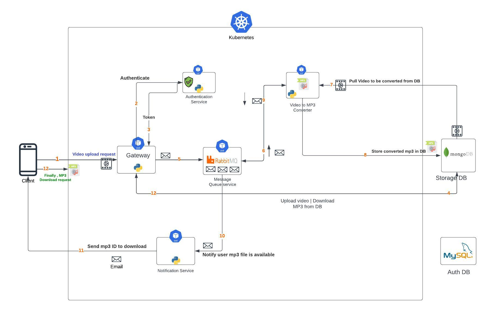

# PYTHON BASED MICROSERVICES

## VIDEO TO MP3 CONVERSION MICROSERVICES

### A. Basic Application Architecture

- [System Architecture](architecture/python-Microservices.jpeg)



#### A.1. Video To MP3 Conversion Flow:

1. User(`Client`) Submit a Video upload Request with Credentials through The ```API Gateway```.

2. The User Get Authenticated by the ```Auth Service``` .

3. Once Submitted Credentials are valid, the Auth Service return a JWT Token to the User(`Client`) to Access Services.

4. Video File is stored into ```Dynamo DB``` .

5. A Message is `produced` and stored into ```Message Queue Service``` [in the queue named `video` for example] containing the ID of the Video File.

    - When storing messages fails, the video file will be deleted as it will never be consumed, and return the Error.

6. The ```MP3 Converter Service``` consume the message from the Queue identified by Unique ID.

7. The ```MP3 Converter Service``` checks and retrieves a video to be converted into mp3, from Dynamo DB, identified by same ID of the Message.

8. The finished `MP3 file` is stored into Dynamo DB. 

9. A Message is `produced` and stored into Message Queue Service, [ In the queue named `mp3` for example ].

    - When storing messages fails, the mp3 file will be deleted as it will never be consumed, and return the Error.

10. ```Notification Service``` Consumes the message from the `mp3` queue. To Notify User (`Client`) the MP3 file is available for Download.

    - When storing messages fails, the mp3 file will be deleted as it will never be consumed, and return the Error.

11. The ```Notification Service``` sends email message tho the user (`Client`) including the ID of the MP3 file ready to be downloaded.

12. The User (`Client`) Finally makes MP3 download request.


### B. Dependencies

#### B.1. Python
[Download and install the python](https://www.python.org/downloads/).

#### B.2. Docker Desktop
You would require you to install Docker Desktop to create containers for individual microservices. Refer the following links for instructions 
* [macOS](https://docs.docker.com/docker-for-mac/install/), 
* [Windows 10 64-bit: Pro, Enterprise, or Education](https://docs.docker.com/docker-for-windows/install/), 
* [Windows  10 64-bit Home](https://docs.docker.com/toolbox/toolbox_install_windows/). 
* You can find installation instructions for other operating systems at:  https://docs.docker.com/install/

#### B.3. Kubernetes 
You would need to install any one tool for creating a Kubernetes cluster - KubeOne / Minikube / kubectl on top of Docker Desktop:
1. [Install and Set Up kubectl](https://kubernetes.io/docs/tasks/tools/install-kubectl/) directly on top of Docker desktop - For Windows/macOS
2. [Install Minikube](https://kubernetes.io/docs/tasks/tools/install-minikube/) - For Linux/macOS

#### B.4. Make
1. [Install Make on Windows](https://linuxhint.com/install-use-make-windows/)
2. [Install Make on Linux](https://linuxhint.com/install-use-make-ubuntu/)

### C. Project Setup Instructions:


Once Docker, Minikube, Kubernetes and Optionally K9s for Containers management are Installed in your PC, let's set it up.


##### C.1. DATABASES SETUP (MySQL & MongoDB):

To Avoid flooding your PC with a lot of intallations on physical hardware, I prefer to run `MyQL and MongoDB` inside containers, but you can do it diffefently if you want.

1. MYSQL:

Run in terminal: ```make mysql-setup``` you can refer to the `Makefile` for other commands.

- Run the initial.sql to Create MySQL User, Necessary permissions, tables and Insert initial data into tables.

2. MongoDB:

Run in terminal: ```make mongo-setup``` you can refer to the `Makefile` for other commands.


##### C.2. KUBERNETES CLUSTER SETUP :

3. Start Minikube
    - Run in your terminal ```minikube start```
    - Enable Ingress Addon: ```minikube addons enable ingress```
    - Check currently running ingress in `default` namespace: ```kubectl get ingress -n default``` The ingress and their IP will be returned.

4. Configure custom domains in your local host. Map the above Ingress IP in the `sudo nano /etc/hosts`

    eg: #192.168.49.2 mp3converter.com -> To hit the API Gateway.
        #192.168.49.2 rabbitmq-manager.com -> For RabbitMQ UI

5. If you have K9s installed to manage your cluster Containers (`Optional`): Run this in your terminal ```k9s```.


##### C.3. DEPLOY OUR APP SERVICES :

While Inside the Root Project Directory

DEPLOY `API-GATEWAY` : Run in terminal ```make gateway-deploy```.

DEPLOY `AUTH-SERVICE` : Run in terminal ```make auth-deploy```.

DEPLOY `MESSAGE-QUEUE` SERVICE : Run in terminal ```make rabbitmq-deploy```.

DEPLOY `CONVERTER-SERVICE` : Run in terminal ```make converter-deploy```.

DEPLOY `NOTIFICATION-SERVICE` : Run in terminal ```make notif-deploy```.

- You can check additional commands in the *[Makefile](Makefile) for the individual service.

6. Check the status, logs of each container in K9s.


